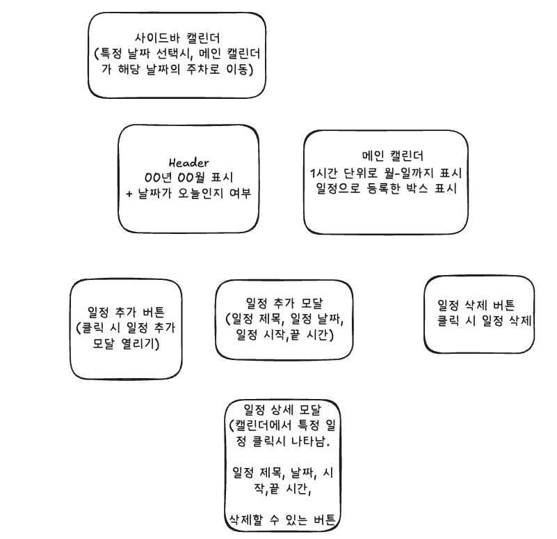

### 요구사항\_정리

- 궁극적으로 구글 캘린더의 [주별 화면]페이지의 클론
- 좌측 Datepicker 상단의 < , > 버튼을 통해 날짜 이동 시 좌측의 Datepicker와 우측의 달력이 `일주일 간의 단위`로 이동한다. redux를 사용한다,
- 캘린더의 좌측 Datepicker를 선택 시 우측의 주별보기 화면의 달력에 `해당 주차`로 이동한다.
- 이벤트 추가 시 modal 창이 열리며, 이벤트 추가가 완료된 이후에는, 우측 달력에 표시된다.
- 우측의 달력인 `1시간 단위`의 간격으로 구분되어 있다.
- 일정 추가 시 모달에는 제목, 날짜, 시작 시간, 끝 시간을 입력해야 한다.
- 추가된 일정을 클릭하면 일정의 상세 정보와 삭제할 수 있는 버튼이 나온다.
- 삭제 버튼을 클릭시 해당 일정의 Box가 삭제된다.
- 날짜 이동을 했다가, 일정이 있는 주간에 들어오면, 기존 등록 된 일정이 보여야 한다.

### 필요한 컴포넌트들 정리



### 트러블슈팅 및 새로 학습한 기록, 고민한 기록

#### 좌측의 Sidebar캘린더와 메인 WeeklyCalendar의 연동

좌측의 Sidebar 켈린더에서 이전 화살표를 눌러서 이전 달로, 다음 화살표를 눌러서 다음 달로 갔을 때 메인 WeelyCalendar의 주차도 바뀌어야 하고, 마찬가지로 최상단 헤더에 이전 달 아이콘, 다음 달 아이콘을 누르면 메인 WeelkyCalendar와 좌측 Sidebar의 캘린더 모두 바뀌어야 하는 상황이었습니다.

제가 생각했을 때, `하나의 날짜`를 전역적인 상태로 관리를 하고, 좌측 Sidebar 캘린더, 메인 WeelyCalendar 모두 `해당 상태를 따라가도록` 구현하는 것이 맞다고 판단했습니다.

날짜 이동시와, 다음 달로 가는 등의 동작을 위해 각 케이스 별로 reducer를 정의하였습니다.

```tsx
reducers: {
    shiftToPrevWeekReducer: (state) => {
      const prevWeekDate = subWeeks(new Date(state.date), 1);
      state.date = format(prevWeekDate, "yyyy-MM-dd");
    },
    shiftToNextWeekReducer: (state) => {
      const nextWeekDate = addWeeks(new Date(state.date), 1);
      state.date = format(nextWeekDate, "yyyy-MM-dd");
    },
    shiftToNextMonthReducer: (state) => {
      const nextMonthDate = addMonths(new Date(state.date), 1);
      state.date = format(nextMonthDate, "yyyy-MM-dd");
    },
    shiftToPrevMonthReducer: (state) => {
      const prevMonthDate = subMonths(new Date(state.date), 1);
      state.date = format(prevMonthDate, "yyyy-MM-dd");
    },
    setDateReducer: (state, action: PayloadAction<string>) => {
      //유효한 날짜인지 검증
      state.date = format(new Date(action.payload), "yyyy-MM-dd");
    },
  },

//reacy-day-picker를 사용할 떄
onPrevClick={() => dispatch(shiftToPrevMonthReducer())}
onNextClick={() => dispatch(shiftToNextMonthReducer())}
```

#### 타입스크립트와 redux

외부 컴포넌트에서 `configureStore`의 `state`,`dispatch`를 위해서 타입을 지정해주어야 합니다.

```tsx
export type RootState = ReturnType<typeof store.getState>;
export type AppDisPatch = typeof store.dispatch;
```

- RootState : Redux 스토어의 state를 나타내는 타입
- AppDispatch : Redux 액션을 dispatch하는 함수의 타입

자바스크립트를 이용한 redux의 경우 `useDispatch`, `useSelector`를 사용해서 컴포넌트 -> 스토어로의 접근을 하였지만, 타입스크립트에서는 기존 훅에 새로 정의한 타입을 추가해주어야 합니다.

타입스크립트와 호환되는 `useDispatch`,`useSelector`를 커스텀 훅으로 분리하였습니다.

```tsx
//use-redux

import { useDispatch, useSelector } from "react-redux";
import type { TypedUseSelectorHook } from "react-redux";

import type { RootState, AppDispatch } from "../store/index";

export const useAppDispatch: () => AppDispatch = useDispatch;
export const useAppSelector: TypedUseSelectorHook<RootState> = useSelector;
```

이렇게 하면 컴포넌트에서 타입정의된 state, dispatch를 통해, 훨씬 유용하게 사용할 수 있습니다.

#### 새로고침, 달력 이동시에도 추가된 일정을 유지하게 하였습니다.

새로고침시에도,달력 이동 시에도 추가된 일정을 유지하기 위해서, `브라우저의 로컬 스토리지`를 사용하였다. `redux-persist`를 이용해, `등록된 일정목록`을 새로고침이나, 이동시에도 유지되게 구현하였다.

#### date-fns로 날짜 관련 함수, 형식의 일관성을 추가하였습니다.

react-day-picker가 내부 의존성으로 date-fns를 사용하고 있는 점을 고려하여, date-fns로 날짜 형식 , 포맷팅, 날짜 유틸함수 등을 관리하고자 하였습니다.

캘린더를 구현할 때 가장 어려운 점은 각 날짜마다 오전 1시,,오후 13시... 이런 형식을 나타내주어야 하는 점이었는데요.

date-fns의 `eachHourOfInterval`로 24개의 단위로 분리를 한 이후, 1,13 이런 숫자들을 오전 1시, 오후 13시 등으로 포맷팅해주는 유틸함수를 구현하여서 풀고자 하였습니다.

#### 모든 상태 관리를 redux-toolkit으로 관리해보자.

redux를 사용하는 조건이 있었기 떄문에, `모든 상태관리`를 redux로 관리하고자 하였습니다. 대표적으로는 `모달의 상태`인데요. 전역적으로 모달을 관리하여, 복잡도를 줄이고 싶었습니다.

모달의 state는 모달 type을 string으로, modal 오픈 여부를 나타내는 isOpen으로 가지고 있습니다.

```tsx
import { createSlice, PayloadAction } from "@reduxjs/toolkit";

interface ModalStateProps {
  isOpen: boolean;
  modalType: string;
}

const modalSlice = createSlice({
  name: "modal-slice",
  initialState: {
    isOpen: false,
    modalType: "",
  } as ModalStateProps,
  reducers: {
    openModal: (
      state,
      actions: PayloadAction<{
        modalType: string;
      }>
    ) => {
      const { modalType } = actions.payload;
      state.modalType = modalType;
      state.isOpen = true;
    },
    closeModal: (
      state,
      actions: PayloadAction<{
        modalType: string;
      }>
    ) => {
      const { modalType } = actions.payload;
      state.modalType = modalType;
      state.isOpen = false;
    },
    toggleModal: (
      state,
      actions: PayloadAction<{
        modalType: string;
      }>
    ) => {
      const { modalType } = actions.payload;
      state.modalType = modalType;
      state.isOpen = !state.isOpen;
    },
  },
});

export const { openModal, closeModal, toggleModal } = modalSlice.actions;

export default modalSlice.reducer;
```

그리고 이어서, 모든 모달을 관리해주는 `GlobalModal`을 만들고, `modalType`을 받아서 Component를 반환하였습니다.

```tsx
import { ScheduleAddModal } from "./ScheduleAddModal";

import { useAppSelector } from "../../hooks/use-redux";
import { ScheduleDetailModal } from "./ScheduleDetailModal";

const MODAL_TYPES = {
  ScheduleAddModal: "ScheduleAddModal",
  ScheduleDetailModal: "ScheduleDetailModal",
};

const MODAL_COMPONENTS = [
  {
    type: MODAL_TYPES.ScheduleAddModal,
    component: <ScheduleAddModal />,
  },
  {
    type: MODAL_TYPES.ScheduleDetailModal,
    component: <ScheduleDetailModal />,
  },
];

export const GlobalModal = () => {
  const { modalType, isOpen } = useAppSelector((state) => state.modal);

  const findRenderModal = MODAL_COMPONENTS.find((modal) => {
    return modal.type === modalType;
  });

  const RenderModalComponent = () => {
    return findRenderModal?.component;
  };

  return <div role="dialog">{isOpen && <RenderModalComponent />}</div>;
};
```
